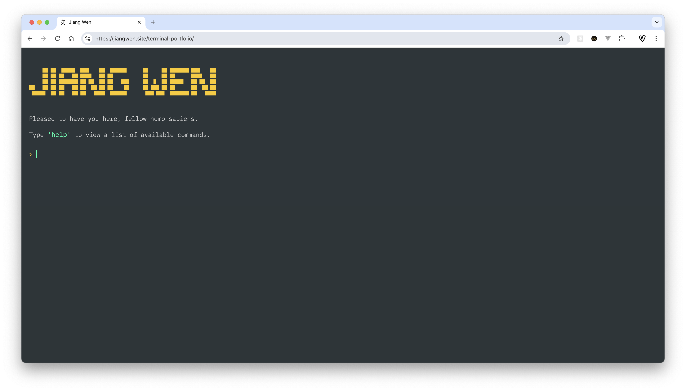
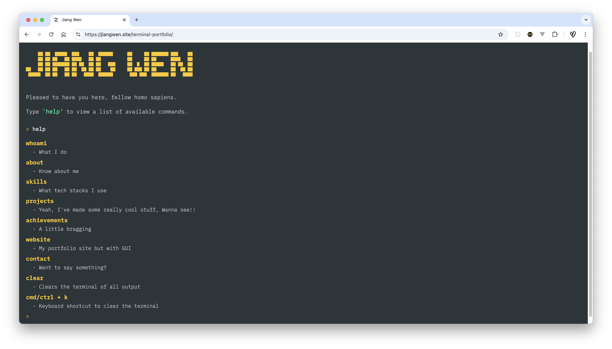

# 终端风格的个人作品集网站
## 目录

- [概述](#概述)
- [截图](#截图)
- [链接](#链接)
- [所用技术](#所用技术)

# 终端风格的个人作品集网站
## 概述

- 这不是一个典型的图形用户界面（GUI）个人作品集网站。相反，你可以通过命令行界面访问我的个人信息。
- 你可以输入 `help` 命令查看所有可用命令。
- 通过输入不同的命令，你可以了解很多关于我的信息，包括我的身份、资质、参与过的项目、我的联系方式等等。
- 你可以使用 `website` 命令访问我的图形用户界面个人作品集网站。
- 我使用 HTML、CSS 和原生 JavaScript 创建了这个项目。

# 终端风格的个人作品集网站
## 截图

# 终端风格的个人作品集网站
## 链接

- 在线站点 URL: [https://jiangwen.site/terminal-portfolio/](https://jiangwen.site/terminal-portfolio/)

# 终端风格的个人作品集网站
## 所用技术

- HTML
- CSS
- JavaScript
- Sanity.io API